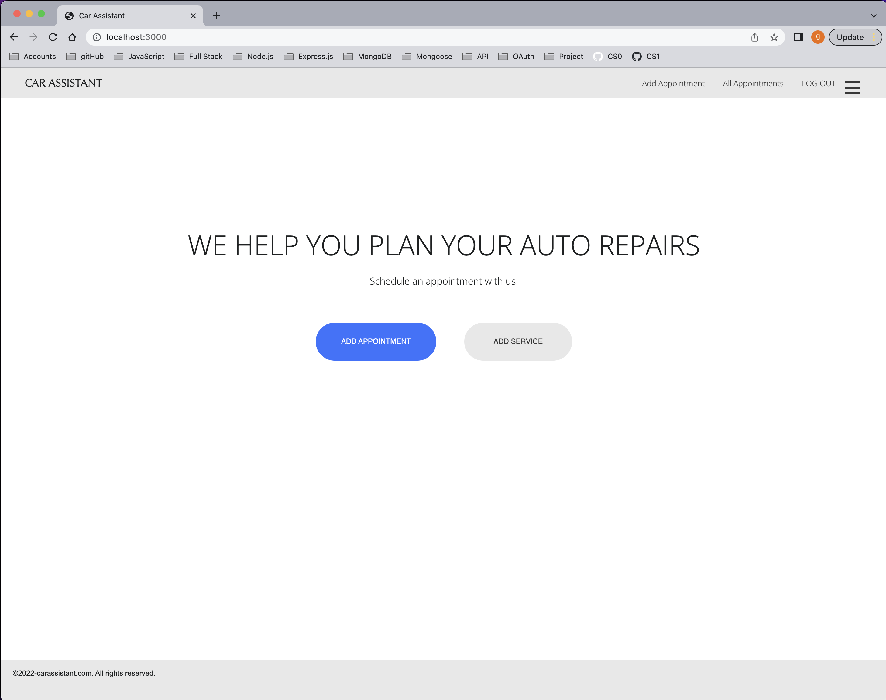
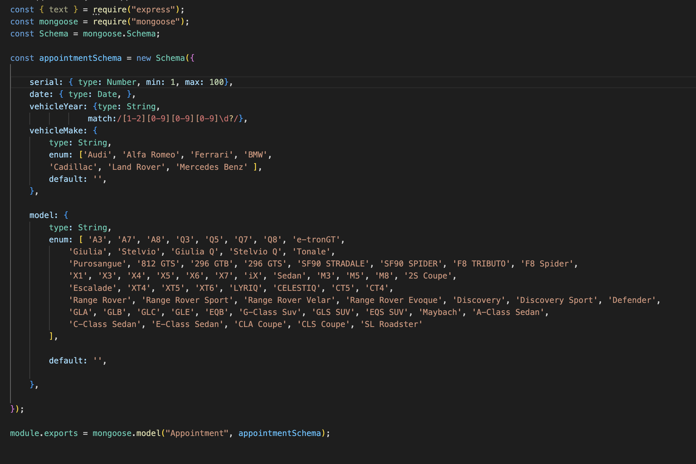
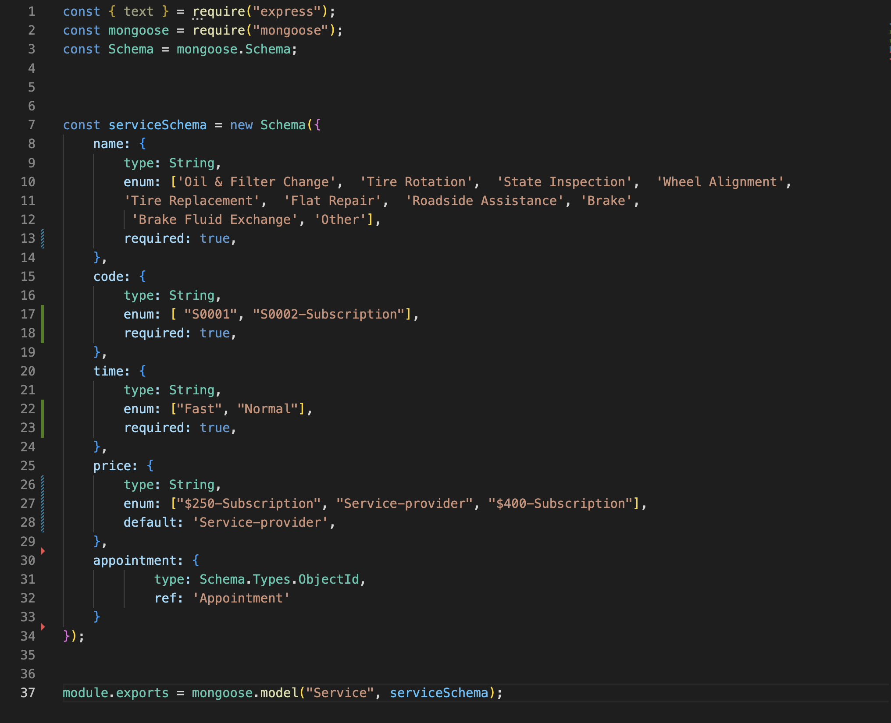

# CAR ASSISTANT

CAR ASSISTANT (CA) is a Node/Express/MongoDB full stack application. This app helps users manage and plan their vehicle's auto repairs. 

The idea was created to put into practise many concepts previously reviewed and full- CRUD data operations. CA was ideated to solve a real life problem, that many car ownwers have to deal with.

 

## User Stories

1. AAU, Log into my account, so I can access to the app.
1. AAU, I can create a new appointment by entering the information on a page that has a form and submitting it.
1. AAU, I want to see a list of all the appointments I’ve made.
1. AAU, I want to see a button for details for every car appointment.
1. AAU, Once I click “+”, I want to be able to see my appointment details.
1. AAU, I want to be able to eliminate appointments.
1. AAU, I want to create a service in my car’s appointment page. Filling a form so it can select the type of service I want (price included).
1. AAU, I want to be able to edit a service in my cars appointment page with an “Edit” button. I can have multiple services per appointment.
1. AAU, I want to be able to access each view via a navigation bar at the top of the page with links to:
	ALL APPOINTMENTS,
	ADD APPOINTMENT.

## Planning

1. Reviewed project requirements.
1. Brainstorming session with colleages.
1. Created an ER diagram.
1. Wrote user stories.
1. Designed wireframes in Illustrator.

## Process

1. Created a trello board with all goals to complete.
1. Wrote code for UI.
1. Wrote code for functionality, feature by feature.
1. Tested its functionality.

## DATA ENTITIES / MODEL

The appointment schema contains many characteristics of the vehicle, and it is the main model for this app. 

This model has different functionalities, using CRUD

## Appointment Schema

## Service Schema

## API PATHS AND METHODS

### User/Authentication

| Method  | URL  |
|:----------|:----------|
| GET   | "/"    |
| GET    | "auth/google"    |
| GET    | "oauth2callback"    |
| GET    | "/logout"    |

### Appointment

|Method | URL |
|:----------|:----------|
|GET   | "/new"   |
GET   | "/"   |
GET   | "/:id"    |
|POST | "/"   |
|DELETE    | "/:id"   |

### Service

| Method  | URL |
|:----------|:----------|
| GET  | "/appointments/:id/services/new"  |
| GET    | "/services/:id/edit"   |
| POST    | "/appointments/:id"   |
| PUT    | "/services/:id"    |

## Technologies Used

- Node.JS 
- JavaScript
- EJS
- Express.JS
- MongoDB
- Mongoose
- HTML
- CSS
- Adobe Illustrator (All images were designed in Illustrator for personal preference).

## ICE BOX/ FUTURE IMPROVEMENTS

- Add a "Priority" feature.
- Create a new identity called Providers.
- Make Providers real time information integrate with CA application.
- Add a third party API: google maps, to search for closest providers, and provide location acuracy.
- Improve dropdown menus.
- Add a feature to allow users to rate providers, and services.

## LINKS & REFERENCES

- [User Stories](https://docs.google.com/document/d/1I9iYG5fWQbXhT_h5o83vtI9FdkZCAhR-AsAmxAwqhAo/edit?usp=sharing)
- [Trello Board](https://trello.com/invite/b/uRlkB7fx/ATTI500fe65321379f938e0f21f974913027A2B06AB0/carassistanceapp)
- [Wireframes](https://docs.google.com/document/d/1BD2KFYGIQBmWolUziVCZ8cUQI0uCVZrRcHTQdVZCH1Y/edit?usp=sharing)
- [ERD](https://docs.google.com/document/d/1TzmRxZaIm27CvyuIdwkvoDim3iEVFDhnx_z-5cusjHE/edit?usp=sharing)
- [Guide to Add a Feature to a Web App](https://gist.github.com/jim-clark/9f9bd19d60d9ce2ec57be8242b6aee96)
